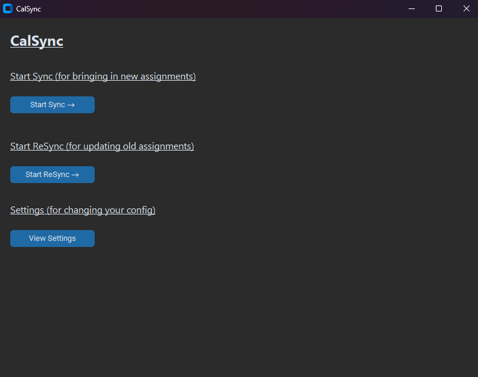

# Gradescope CalSync

An *unofficial* tool enabling students to sync Gradescope with Google Calendar (and more*).

Gradescope CalSync automatically imports your Gradescope assignments into Google Calendar as events, helping you manage your busy academic schedule! Via the resync feature, it is also capable of accounting for due dates being updated / extensions.


## Setup and Usage

1. Ensure you have Python 3.8+ and pip installed
2. Clone the project / download the zip
3. In the root directory using cmd run:
```cmd
pip install -r requirements.txt
```
4. [Setup the Google calendar environment](https://developers.google.com/workspace/calendar/api/quickstart/python#set-up-environment) and [authorize your credentials](https://developers.google.com/workspace/calendar/api/quickstart/python#authorize_credentials_for_a_desktop_application), saving the resultant json file as credentials.json file in the root directory
5. Run the program by running the following in the root directory:
```cmd
python main.py
```
If you accidentally run the program before providing you credentials file, please be sure to delete the token.json that can be found in the root folder before running again.

## Screenshots




## Acknowledgements

 - [Gradescope API](https://github.com/nyuoss/gradescope-api)
 - [Custom Tkinter](https://github.com/TomSchimansky/CustomTkinter)
 - [CustomTkinterMessagebox](https://github.com/horue/CustomTkinter-Messagebox)

## Appendix

\*If you wish to use another calendar besides Google Calendar (ie iCloud Calendar), you can have the program sync to Google Calendar and then copy the iCal link found in settings into the Calendar app of your choice.

Note that syncing may take a bit and that the application will stall during this time due to lack of threading.

There are some assignments for which the Gradescope api I am using returns a none assignment ID. From my testing this results from assignments marked as ungraded, so I am ignoring them. 

I am happy to take any questions regarding these issues, or any others, through Github's contact systems.

Thank you for using Gradescope CalSync!

